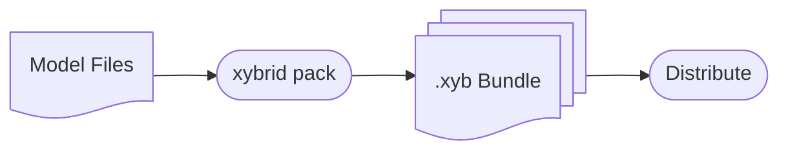

Package models into distributable `.xyb` bundles.

## Overview

The packaging workflow:



## Phase 4: Package Models

### Prepare Model Directory

Create a directory with your model artifacts:

```
models/my-model/
├── model_metadata.json    # Required: execution config
├── model.onnx             # Model weights
├── vocab.json             # Vocabulary (if needed)
└── tokens.txt             # Token list (if needed)
```

### Create model_metadata.json

Every model needs execution configuration:

```json
{
  "model_id": "my-model",
  "version": "1.0",
  "description": "My custom model",

  "execution_template": {
    "type": "SimpleMode",
    "model_file": "model.onnx"
  },

  "preprocessing": [
    { "type": "AudioDecode", "sample_rate": 16000, "channels": 1 }
  ],

  "postprocessing": [
    { "type": "CTCDecode", "vocab_file": "vocab.json", "blank_index": 0 }
  ],

  "files": ["model.onnx", "vocab.json"]
}
```

### Pack the Bundle

```bash
xybrid pack my-model --version 1.0.0 --target onnx
```

This writes `./dist/my-model-1.0.0-onnx.xyb` containing:

```
my-model-1.0.0-onnx.xyb/
├── manifest.json          # Bundle metadata + hash
├── model_metadata.json    # Execution config
├── model.onnx             # Model weights
└── vocab.json             # Supporting files
```

### Runtime Format Variants

The `--target` flag tags the runtime format the bundle is compiled for. Supported values: `onnx`, `coreml`, `tflite`, `generic` (default: `onnx`).

```bash
# ONNX Runtime (works on macOS, iOS, Android, Linux, Windows)
xybrid pack whisper-tiny --version 1.0.0 --target onnx

# CoreML (Apple Silicon optimisation)
xybrid pack whisper-tiny --version 1.0.0 --target coreml

# TensorFlow Lite (mobile)
xybrid pack whisper-tiny --version 1.0.0 --target tflite
```

## Phase 5: Distribute the Bundle

The `.xyb` file written to `./dist/` is self-contained. Distribute it however suits your project:

- Attach to a GitHub release
- Host on HuggingFace, S3, or any HTTP server
- Ship inside an app bundle

Consumers load the bundle directly without going through a registry:

```bash
xybrid run --bundle ./dist/my-model-1.0.0-onnx.xyb --input-text "Hello"
```

```rust
let model = ModelLoader::from_bundle("./dist/my-model-1.0.0-onnx.xyb")?.load()?;
```

```dart
final model = await XybridModelLoader.fromBundle('my-model-1.0.0-onnx.xyb').load();
```

If you want to publish to the public xybrid registry, see the `xybrid bundle` command, which fetches a published model and produces a `.xyb`.

## Bundle Types

### ASR Bundle (Wav2Vec2)

```json
{
  "model_id": "wav2vec2-base-960h",
  "version": "1.0",
  "execution_template": {
    "type": "SimpleMode",
    "model_file": "model.onnx"
  },
  "preprocessing": [
    { "type": "AudioDecode", "sample_rate": 16000, "channels": 1 }
  ],
  "postprocessing": [
    { "type": "CTCDecode", "vocab_file": "vocab.json", "blank_index": 0 }
  ]
}
```

### ASR Bundle (Whisper/Candle)

```json
{
  "model_id": "whisper-tiny",
  "version": "1.0",
  "execution_template": {
    "type": "CandleModel",
    "model_type": "WhisperTiny"
  },
  "preprocessing": [
    { "type": "AudioDecode", "sample_rate": 16000, "channels": 1 }
  ],
  "postprocessing": []
}
```

### TTS Bundle (Kokoro)

```json
{
  "model_id": "kokoro-82m",
  "version": "0.1",
  "execution_template": {
    "type": "SimpleMode",
    "model_file": "model.onnx"
  },
  "preprocessing": [
    {
      "type": "Phonemize",
      "tokens_file": "tokens.txt",
      "backend": "EspeakNG"
    }
  ],
  "postprocessing": [
    {
      "type": "TTSAudioEncode",
      "sample_rate": 24000,
      "apply_postprocessing": true
    }
  ]
}
```

## Next Steps

- [Registry](/docs/concepts/registry) - Registry architecture details
- [Bundles](/docs/concepts/bundles) - Bundle format specification
