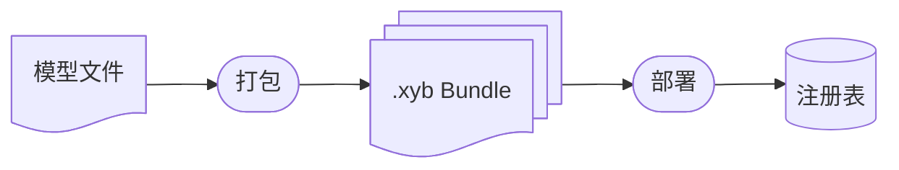

将模型打包为可分发的 `.xyb` Bundle 并发布到注册表。

## 概览

部署工作流：



## 第四阶段：打包模型

### 准备模型目录

创建一个包含模型文件的目录：

```
models/my-model/
├── model_metadata.json    # 必填：执行配置
├── model.onnx             # 模型权重
├── vocab.json             # 词汇表（如需要）
└── tokens.txt             # Token 列表（如需要）
```

### 创建 model_metadata.json

每个模型都需要执行配置：

```json
{
  "model_id": "my-model",
  "version": "1.0",
  "description": "My custom model",

  "execution_template": {
    "type": "SimpleMode",
    "model_file": "model.onnx"
  },

  "preprocessing": [
    { "type": "AudioDecode", "sample_rate": 16000, "channels": 1 }
  ],

  "postprocessing": [
    { "type": "CTCDecode", "vocab_file": "vocab.json", "blank_index": 0 }
  ],

  "files": ["model.onnx", "vocab.json"]
}
```

### 打包 Bundle

```bash
xybrid pack my-model --version 1.0.0 --target macos-arm64
```

此命令创建 `my-model@1.0.0.xyb`，包含：

```
my-model@1.0.0.xyb/
├── manifest.json          # Bundle 元数据 + 哈希值
├── model_metadata.json    # 执行配置
├── model.onnx             # 模型权重
└── vocab.json             # 其他所需文件
```

### 平台变体

为每个目标平台创建 Bundle：

```bash
# Apple Silicon Mac
xybrid pack whisper-tiny --version 1.0.0 --target macos-arm64

# iOS
xybrid pack whisper-tiny --version 1.0.0 --target ios-arm64

# Android
xybrid pack whisper-tiny --version 1.0.0 --target android-arm64
```

## 第五阶段：部署到注册表

### 本地注册表

部署到本地缓存：

```bash
xybrid deploy my-model@1.0.0.xyb --registry local
```

Bundle 存储路径：

```
~/.xybrid/registry/
├── index.json                    # Bundle 索引
└── my-model/
    └── 1.0.0/
        └── macos-arm64/
            └── my-model.xyb
```

### 远程注册表

部署到 HTTP 注册表：

```bash
xybrid deploy my-model@1.0.0.xyb --registry remote -p https://registry.xybrid.dev
```

### 验证部署

检查注册表索引：

```bash
cat ~/.xybrid/registry/index.json
```

```json
{
  "my-model/1.0.0/macos-arm64": {
    "model_id": "my-model",
    "version": "1.0.0",
    "target": "macos-arm64",
    "size_bytes": 12345678,
    "path": "~/.xybrid/registry/my-model/1.0.0/macos-arm64/my-model.xyb"
  }
}
```

## Bundle 类型

### ASR Bundle（Wav2Vec2）

```json
{
  "model_id": "wav2vec2-base-960h",
  "version": "1.0",
  "execution_template": {
    "type": "SimpleMode",
    "model_file": "model.onnx"
  },
  "preprocessing": [
    { "type": "AudioDecode", "sample_rate": 16000, "channels": 1 }
  ],
  "postprocessing": [
    { "type": "CTCDecode", "vocab_file": "vocab.json", "blank_index": 0 }
  ]
}
```

### ASR Bundle（Whisper/Candle）

```json
{
  "model_id": "whisper-tiny",
  "version": "1.0",
  "execution_template": {
    "type": "CandleModel",
    "model_type": "WhisperTiny"
  },
  "preprocessing": [
    { "type": "AudioDecode", "sample_rate": 16000, "channels": 1 }
  ],
  "postprocessing": []
}
```

### TTS Bundle（Kokoro）

```json
{
  "model_id": "kokoro-82m",
  "version": "0.1",
  "execution_template": {
    "type": "SimpleMode",
    "model_file": "model.onnx"
  },
  "preprocessing": [
    {
      "type": "Phonemize",
      "tokens_file": "tokens.txt",
      "backend": "EspeakNG"
    }
  ],
  "postprocessing": [
    {
      "type": "TTSAudioEncode",
      "sample_rate": 24000,
      "apply_postprocessing": true
    }
  ]
}
```

## 使用 justfile 命令

项目内置了便捷命令：

```bash
# 创建所有 Bundle
just registry::create

# 创建指定 Bundle
just registry::create-bundle whisper-tiny

# 检查缓存状态
just registry::cache-status

# 启动本地注册表服务器
just registry::serve-local

# 清理注册表
just registry::clean
```

## 注册表服务器

通过 HTTP 提供 Bundle 以供分布式访问：

```bash
just registry::serve-local
```

此命令在 8080 端口提供 `~/.xybrid/registry/` 服务。客户端可获取 Bundle：

```bash
curl http://localhost:8080/bundles/whisper-tiny/1.0/macos-arm64/whisper-tiny.xyb
```

## 下一步

- [注册表](/zh/docs/concepts/registry) — 注册表架构详情
- [Bundle](/zh/docs/concepts/bundles) — Bundle 格式规范
