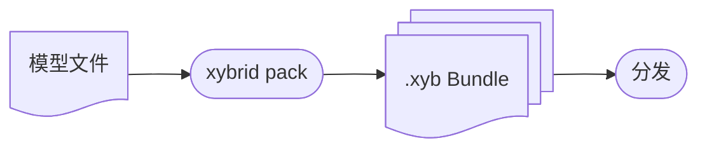

将模型打包为可分发的 `.xyb` Bundle。

## 概览

打包工作流：



## 第四阶段：打包模型

### 准备模型目录

创建一个包含模型文件的目录：

```
models/my-model/
├── model_metadata.json    # 必填：执行配置
├── model.onnx             # 模型权重
├── vocab.json             # 词汇表（如需要）
└── tokens.txt             # Token 列表（如需要）
```

### 创建 model_metadata.json

每个模型都需要执行配置：

```json
{
  "model_id": "my-model",
  "version": "1.0",
  "description": "My custom model",

  "execution_template": {
    "type": "SimpleMode",
    "model_file": "model.onnx"
  },

  "preprocessing": [
    { "type": "AudioDecode", "sample_rate": 16000, "channels": 1 }
  ],

  "postprocessing": [
    { "type": "CTCDecode", "vocab_file": "vocab.json", "blank_index": 0 }
  ],

  "files": ["model.onnx", "vocab.json"]
}
```

### 打包 Bundle

```bash
xybrid pack my-model --version 1.0.0 --target onnx
```

此命令写入 `./dist/my-model-1.0.0-onnx.xyb`，包含：

```
my-model-1.0.0-onnx.xyb/
├── manifest.json          # Bundle 元数据 + 哈希值
├── model_metadata.json    # 执行配置
├── model.onnx             # 模型权重
└── vocab.json             # 其他所需文件
```

### 运行时格式变体

`--target` 参数标识 Bundle 编译的运行时格式。支持的值：`onnx`、`coreml`、`tflite`、`generic`（默认：`onnx`）。

```bash
# ONNX Runtime（适用于 macOS、iOS、Android、Linux、Windows）
xybrid pack whisper-tiny --version 1.0.0 --target onnx

# CoreML（Apple Silicon 优化）
xybrid pack whisper-tiny --version 1.0.0 --target coreml

# TensorFlow Lite（移动端）
xybrid pack whisper-tiny --version 1.0.0 --target tflite
```

## 第五阶段：分发 Bundle

写入 `./dist/` 的 `.xyb` 文件是自包含的。可以按项目需要任意分发：

- 附加到 GitHub Release
- 托管在 HuggingFace、S3 或任意 HTTP 服务器
- 打包进应用本身

消费方无需经过注册表，直接加载 Bundle：

```bash
xybrid run --bundle ./dist/my-model-1.0.0-onnx.xyb --input-text "Hello"
```

```rust
let model = ModelLoader::from_bundle("./dist/my-model-1.0.0-onnx.xyb")?.load()?;
```

```dart
final model = await XybridModelLoader.fromBundle('my-model-1.0.0-onnx.xyb').load();
```

如需发布到 xybrid 公共注册表，请参阅 `xybrid bundle` 命令——它会从已发布的模型构建 `.xyb`。

## Bundle 类型

### ASR Bundle（Wav2Vec2）

```json
{
  "model_id": "wav2vec2-base-960h",
  "version": "1.0",
  "execution_template": {
    "type": "SimpleMode",
    "model_file": "model.onnx"
  },
  "preprocessing": [
    { "type": "AudioDecode", "sample_rate": 16000, "channels": 1 }
  ],
  "postprocessing": [
    { "type": "CTCDecode", "vocab_file": "vocab.json", "blank_index": 0 }
  ]
}
```

### ASR Bundle（Whisper/Candle）

```json
{
  "model_id": "whisper-tiny",
  "version": "1.0",
  "execution_template": {
    "type": "CandleModel",
    "model_type": "WhisperTiny"
  },
  "preprocessing": [
    { "type": "AudioDecode", "sample_rate": 16000, "channels": 1 }
  ],
  "postprocessing": []
}
```

### TTS Bundle（Kokoro）

```json
{
  "model_id": "kokoro-82m",
  "version": "0.1",
  "execution_template": {
    "type": "SimpleMode",
    "model_file": "model.onnx"
  },
  "preprocessing": [
    {
      "type": "Phonemize",
      "tokens_file": "tokens.txt",
      "backend": "EspeakNG"
    }
  ],
  "postprocessing": [
    {
      "type": "TTSAudioEncode",
      "sample_rate": 24000,
      "apply_postprocessing": true
    }
  ]
}
```

## 下一步

- [注册表](/zh/docs/concepts/registry) — 注册表架构详情
- [Bundle](/zh/docs/concepts/bundles) — Bundle 格式规范
