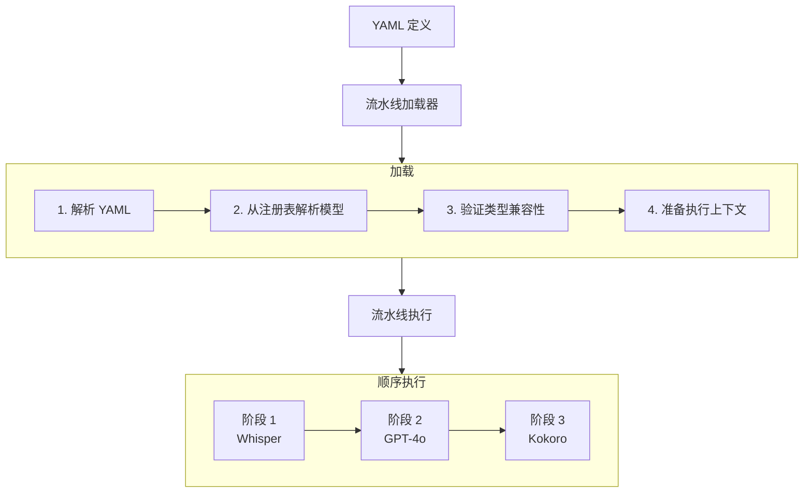

**流水线**是一组对数据进行变换的有序阶段。流水线使用 YAML 定义，由 SDK 执行，支持将多个模型串联（ASR → LLM → TTS），并可在设备端与云端之间自动切换。

## 工作原理



## 基本结构

```yaml
name: "Voice Assistant"
registry: "http://localhost:8080"

input:
  kind: "AudioRaw"

stages:
  - whisper-tiny@1.0
  - kokoro-82m@0.1
```

## 阶段格式

### 简单格式

通过 ID 和版本引用模型：

```yaml
stages:
  - wav2vec2-base-960h@1.0
  - kokoro-82m@0.1
```

### 对象格式

如需更多控制，使用对象格式：

```yaml
stages:
  - name: whisper-tiny@1.0
    target: device
    registry: "http://other-registry:8080"
```

### 集成阶段

用于云端 LLM 执行：

```yaml
stages:
  - whisper-tiny@1.0

  - target: integration
    provider: openai
    model: gpt-4o-mini
    options:
      system_prompt: "You are a helpful voice assistant."
      max_tokens: 150
      temperature: 0.7

  - kokoro-82m@0.1
```

## 执行目标

| 目标 | 说明 | 配置来源 |
|--------|-------------|---------------|
| `device` | 设备端推理 | 来自注册表的 .xyb 包 |
| `integration` | 第三方 API | Provider 配置（OpenAI、Anthropic） |
| `auto` | 框架自动决定 | 运行时解析 |

## 输入类型

声明预期输入类型以进行验证：

```yaml
input:
  kind: "AudioRaw"   # 用于 ASR 流水线
```

```yaml
input:
  kind: "Text"       # 用于 TTS 或文本流水线
```

```yaml
input:
  kind: "Embedding"  # 用于向量搜索
```

## 数据流

每个阶段对一个 Envelope 进行变换：

| 阶段类型 | 输入 | 输出 |
|------------|-------|--------|
| ASR (Whisper) | `AudioRaw` | `Text` |
| LLM (GPT-4o) | `Text` | `Text` |
| TTS (Kokoro) | `Text` | `AudioRaw` |

流水线会验证输出类型与下一阶段期望的输入类型是否匹配。

## 注册表配置

### 简单 URL

```yaml
registry: "http://localhost:8080"
```

### 文件路径（本地）

```yaml
registry: "file:///Users/me/.xybrid/registry"
```

### 完整配置

```yaml
registry:
  local_path: "/Users/me/.xybrid/registry"
  remote:
    base_url: "http://localhost:8080"
    timeout_ms: 30000
    retry_attempts: 3
```

## 集成的提供商

支持的云端 LLM 阶段的提供商：

| 提供商 | 模型 | 备注 |
|----------|--------|-------|
| `openai` | gpt-4o, gpt-4o-mini | 需要 OPENAI_API_KEY |
| `anthropic` | claude-3-5-sonnet | 需要 ANTHROPIC_API_KEY |

## 示例流水线

### 语音助手（ASR → LLM → TTS）

```yaml
name: "Voice Assistant"
registry: "http://localhost:8080"

input:
  kind: "AudioRaw"

stages:
  # 语音识别（设备端）
  - whisper-tiny@1.0

  # 语言模型（云端）
  - target: integration
    provider: openai
    model: gpt-4o-mini
    options:
      system_prompt: "You are a helpful voice assistant. Keep responses brief."
      max_tokens: 150

  # 文字转语音（设备端）
  - kokoro-82m@0.1
```

### 仅语音转文字

```yaml
name: "Transcription"
registry: "http://localhost:8080"

input:
  kind: "AudioRaw"

stages:
  - wav2vec2-base-960h@1.0
```

### 仅文字转语音

```yaml
name: "TTS"
registry: "http://localhost:8080"

input:
  kind: "Text"

stages:
  - kitten-tts-nano@1.0
```

## 运行流水线

### Flutter SDK

```dart
final pipeline = Xybrid.pipeline(filePath: 'assets/pipelines/voice-assistant.yaml');

final result = await pipeline.run(
  XybridEnvelope.audio(bytes: audioBytes, sampleRate: 16000),
);
print(result.text);
```

### Rust SDK

```rust
use xybrid_sdk::PipelineLoader;

let pipeline = PipelineLoader::from_yaml(yaml_content)?
    .load()?;

let result = pipeline.run(&input_envelope)?;
```

## 流水线元数据

查询流水线属性：

```dart
final pipeline = Xybrid.pipeline(filePath: 'pipeline.yaml');

pipeline.name;        // "Voice Assistant"
pipeline.stageCount;  // 3
pipeline.stageNames;  // ["whisper-tiny@1.0", "gpt-4o-mini", "kokoro-82m@0.1"]
```

## 生命周期

1. **加载** — 解析 YAML，从注册表解析模型
2. **验证** — 检查各阶段之间的类型兼容性
3. **执行** — 顺序运行各阶段
4. **卸载** — 释放资源

```dart
// 从 YAML 加载
final pipeline = Xybrid.pipeline(yaml: yamlContent);

// 或从文件加载
final pipeline = Xybrid.pipeline(filePath: 'pipeline.yaml');

// 运行
final result = await pipeline.run(XybridEnvelope.audio(bytes: audioBytes, sampleRate: 16000));
```

## 相关文档

- [注册表](/zh/docs/concepts/registry) — 模型包解析
- [Bundle](/zh/docs/concepts/bundles) — Bundle 格式与元数据
