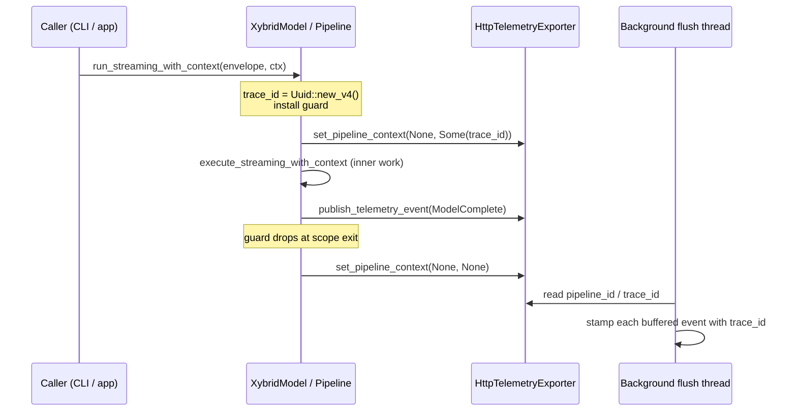

# Trace model

This document describes the contract between the SDK and the dashboard for grouping telemetry events into traces. It is a description of what ships today, not a forward-looking design — the implementation references in code are the source of truth and the line-level pointers in this doc are kept current.

For the wire-format details of the telemetry payload (device profile, event fields, opt-outs), see [`telemetry.md`](telemetry.md). This doc focuses on **how related events are grouped into a single trace**.

## What a trace is

One trace = one end-user-visible inference. Concretely:

| SDK entry point | Trace shape |
|---|---|
| `Pipeline::run(envelope)` / `run_async(envelope)` | One trace covers the whole call; multi-stage pipelines (ASR → LLM → TTS) collapse to a single row in the Traces dashboard. |
| `XybridModel::run_with_context(...)` / `run_streaming_with_context(...)` | One trace per chat turn. Inner LLM events + the SDK's `ModelComplete` event share one `trace_id`. |
| `executor.execute(...)` / `execute_with_context(...)` / `execute_streaming_with_context(...)` | Internal — these are the executor methods the SDK wrappers above call. Their outer spans do not emit user-facing telemetry events; see [Outer-span suppression](#outer-span-suppression). |

Streaming token events are annotations on the existing trace, not new traces. The `trace_id` for a streaming call is the same as for the batch call shape.

## How a `trace_id` is generated and propagated

A `trace_id` is a `uuid::Uuid` generated at the SDK entry point and installed in a process-global exporter context. Every telemetry event published while that context is set inherits the `trace_id` at flush time.

The lifecycle is enforced by an RAII guard so it is impossible to forget the cleanup:

```rust
// In xybrid-sdk/src/telemetry.rs
pub(crate) struct TelemetryPipelineContextGuard;

impl TelemetryPipelineContextGuard {
    pub(crate) fn install(pipeline_id: Option<Uuid>, trace_id: Option<Uuid>) -> Self {
        set_telemetry_pipeline_context(pipeline_id, trace_id);
        Self
    }
}

impl Drop for TelemetryPipelineContextGuard {
    fn drop(&mut self) {
        set_telemetry_pipeline_context(None, None);
    }
}
```

Callers install the guard once at the top of an entry point and let `Drop` handle every exit — success, `?` error propagation, and panic unwind. The clear runs *after* the `publish_telemetry_event` call earlier in the scope because the guard's `Drop` fires at end of scope, which preserves the "publish before clear" ordering the exporter's lazy-read flush relies on.



## Trace-ID generation sites

| Site | What it scopes |
|---|---|
| `xybrid-sdk/src/pipeline/mod.rs` — `Pipeline::run` / `run_async` | One `trace_id` for the whole pipeline call; all stage events inherit it |
| `xybrid-sdk/src/model.rs` — `XybridModel::run_with_context` / `run_streaming_with_context` (+ `_options` variants) | One `trace_id` per chat turn |

Direct `executor.execute*()` calls (outside of `Pipeline::run` or `XybridModel`) do not install a trace context. Their outer spans are suppressed (see below), so the only telemetry events that surface are the SDK-level wrappers above.

## Outer-span suppression

The executor's `execute_*_with_context` methods used to wrap their work with an `ExecutionGuard` that emitted `ExecutionStarted` / `ExecutionCompleted` events. For chat-context paths, the SDK's `ModelComplete` event already carries the user-facing attribution (model_id, backend, EP, cached_tokens, duration, TTFT, …), so the outer guard's emits were duplicate noise that surfaced as separate rows on the Traces dashboard.

`ExecutionGuard::new_silent` (in `xybrid-core/src/execution/listener.rs`) suppresses `Started` and `Completed` emits while preserving `Failed` emission via `set_failed`. The chat-context executor methods construct silent guards:

```rust
// In xybrid-core/src/execution/executor.rs
let guard = ExecutionGuard::new_silent(&metadata.model_id, "execute_streaming_with_context");
let result = self.execute_streaming_with_context_impl(...);
if let Err(e) = &result {
    mark_execution_terminal(&guard, e); // still emits Failed
}
```

Same shape for `execute_with_context`. The other `execute*` methods (`execute`, `execute_streaming`) still use the noisy `new()` because they have no SDK-level `ModelComplete` wrapper on top — that's the rule: a guard is silent when, and only when, an outer SDK event carries the same attribution.

## Per-event override

Most events inherit the `trace_id` from the exporter's pipeline context at flush time. Callers that need to stamp a specific `trace_id` on a single event can set the `__xybrid_trace_id` key in the event's `data` JSON metadata; the converter picks it up in preference to the global context:

```rust
const CONTEXT_TRACE_ID_KEY: &str = "__xybrid_trace_id";
// In convert_telemetry_event: if data has this key, use it; otherwise fall back to global
```

This path is used internally for events produced by code that runs outside the install/drop scope (e.g. delayed background-thread events). External callers should not need it.

## Dashboard collapse contract

On the platform side, [`traces_list.pipe`](https://github.com/xybrid-ai/xybrid-platform/blob/main/tinybird/pipes/traces_list.pipe) groups events by a `trace_key` derived from `trace_id`. Two events that share a `trace_id` collapse to one row; the row's stage label is the one with the richest attribution (typically the inner `ModelComplete` / per-stage event, not the outer pipeline event).

If an event arrives without a `trace_id`, the pipe falls back to per-event grouping. This is the backwards-compat path for old clients that pre-date the trace model — they still produce traces, just one row per event.

## Schema

No telemetry schema change was needed for the trace model. `PlatformEvent.trace_id: Option<Uuid>` already existed in the wire format; the model is the contract about *who sets it* and *when*.

## Known limitations and follow-ups

| | |
|---|---|
| Single-stage `Pipeline::run` still emits a `PipelineComplete` event that surfaces as a separate `pipeline`-type Traces row with no per-inference attribution | Filed as `task-management/issues/dashboard-trace-model/05-single-stage-pipeline-row-noise.md`; fix shape is the sibling of the chat-context change one layer up — suppress for single-stage and share `trace_id` for multi-stage |
| `trace_id` does not propagate across cloud-fallback boundaries | The cloud client opens its own trace context; cross-boundary correlation is out of scope today |
| Direct `executor.execute*()` callers outside the SDK wrappers (CLI scripts, tests) get no `trace_id` and rely on the pipe's per-event fallback | Add a similar RAII guard at any new entry point that needs trace collapsing |

## Code references

| Concern | File |
|---|---|
| `TelemetryPipelineContextGuard`, `set_telemetry_pipeline_context`, `CONTEXT_TRACE_ID_KEY`, flush-time stamping | `crates/xybrid-sdk/src/telemetry.rs` |
| Pipeline trace_id install | `crates/xybrid-sdk/src/pipeline/mod.rs` (`Pipeline::run`, `run_async`) |
| Chat-context trace_id install | `crates/xybrid-sdk/src/model.rs` (`run_with_context`, `run_streaming_with_context`) |
| Silent outer guard for chat-context executor methods | `crates/xybrid-core/src/execution/executor.rs` + `crates/xybrid-core/src/execution/listener.rs` (`ExecutionGuard::new_silent`) |
| Per-event grouping fallback | `tinybird/pipes/traces_list.pipe` in `xybrid-platform` |
